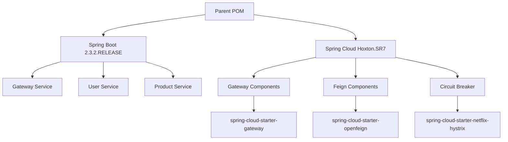

# Design Document

## Overview

本设计文档描述了如何将现有的Spring Cloud微服务项目从当前版本（Spring Boot 2.7.18 + Spring Cloud 2021.0.8）降级到稳定版本（Spring Boot 2.3.2.RELEASE + Spring Cloud Hoxton.SR7），同时确保所有现有功能保持不变。

通过分析当前代码，发现项目使用了以下关键组件：
- Spring Cloud Gateway (WebFlux)
- OpenFeign客户端
- Resilience4j断路器
- Spring Boot Web (传统Servlet)
- Spring Boot Actuator
- WireMock测试框架

## Architecture

### 版本兼容性分析

#### Spring Boot 2.3.2.RELEASE 兼容性
- **支持的功能**: Web MVC, WebFlux, Actuator, Test框架
- **Java版本**: 支持Java 8-14
- **关键变化**: 相比2.7.18版本，2.3.2是更早期但稳定的版本

#### Spring Cloud Hoxton.SR7 兼容性
- **支持的功能**: Gateway, OpenFeign, Circuit Breaker
- **断路器**: 使用Hystrix或Resilience4j
- **关键变化**: Hoxton版本使用不同的断路器配置方式

### 依赖映射策略



## Components and Interfaces

### 1. Parent POM Configuration
- **目标**: 设置统一的版本管理
- **关键配置**:
  - Spring Boot版本: 2.3.2.RELEASE
  - Spring Cloud版本: Hoxton.SR7
  - Java版本: 保持8

### 2. Gateway Service Dependencies
- **核心依赖**:
  - `spring-cloud-starter-gateway`: Gateway路由功能
  - `spring-cloud-starter-openfeign`: Feign客户端
  - `spring-cloud-starter-netflix-hystrix`: 断路器（替换Resilience4j）
- **测试依赖**:
  - WireMock版本需要调整到兼容版本

### 3. User/Product Service Dependencies
- **核心依赖**:
  - `spring-boot-starter-web`: Web MVC功能
  - `spring-boot-starter-actuator`: 监控端点
- **无需变更**: 这些服务使用基础Web功能，兼容性良好

## Data Models

### 版本兼容性数据模型

```java
// 现有的数据模型保持不变
public class ApiResponse {
    // 字段和方法保持原样
}

public class InfoRequest {
    // 字段和方法保持原样
}
```

### 配置属性模型
- **application.properties**: 保持现有配置格式
- **断路器配置**: 从Resilience4j格式调整为Hystrix格式

## Error Handling

### 1. 版本不兼容错误处理
- **策略**: 预先识别不兼容的依赖
- **解决方案**: 提供版本映射和替代方案

### 2. 断路器配置迁移
- **问题**: Resilience4j配置与Hystrix不同
- **解决方案**: 
  - 保持现有Java代码不变
  - 调整配置文件中的断路器属性
  - 使用Hystrix的等效配置

### 3. 测试框架兼容性
- **WireMock版本**: 调整到与Spring Boot 2.3.2兼容的版本
- **测试注解**: 确保测试注解与目标版本兼容

## Testing Strategy

### 1. 依赖兼容性测试
- **单元测试**: 验证所有现有单元测试通过
- **集成测试**: 验证服务间通信正常
- **端到端测试**: 验证完整业务流程

### 2. 版本验证测试
- **依赖树检查**: 确保没有版本冲突
- **启动测试**: 验证所有服务能正常启动
- **功能测试**: 验证所有API端点正常工作

### 3. 回归测试策略
- **现有测试保持**: 不修改任何测试代码
- **配置调整**: 仅调整测试配置以适应新版本
- **性能验证**: 确保性能没有显著下降

## Implementation Considerations

### 1. 最小化代码变更原则
- **Java代码**: 完全不修改业务逻辑代码
- **配置文件**: 仅调整版本相关配置
- **测试代码**: 保持测试逻辑不变

### 2. 渐进式迁移策略
- **阶段1**: 更新parent pom版本
- **阶段2**: 调整子模块依赖
- **阶段3**: 更新配置文件
- **阶段4**: 验证和测试

### 3. 风险缓解措施
- **备份**: 在开始前创建完整备份
- **版本锁定**: 明确指定所有关键依赖版本
- **测试验证**: 每个步骤后运行完整测试套件

### 4. 关键依赖版本映射

| 组件 | 当前版本 | 目标版本 | 兼容性 |
|------|----------|----------|--------|
| Spring Boot | 2.7.18 | 2.3.2.RELEASE | 向下兼容 |
| Spring Cloud | 2021.0.8 | Hoxton.SR7 | 需要配置调整 |
| Circuit Breaker | Resilience4j | Hystrix | 配置迁移 |
| WireMock | 2.35.0 | 2.27.2 | 版本调整 |