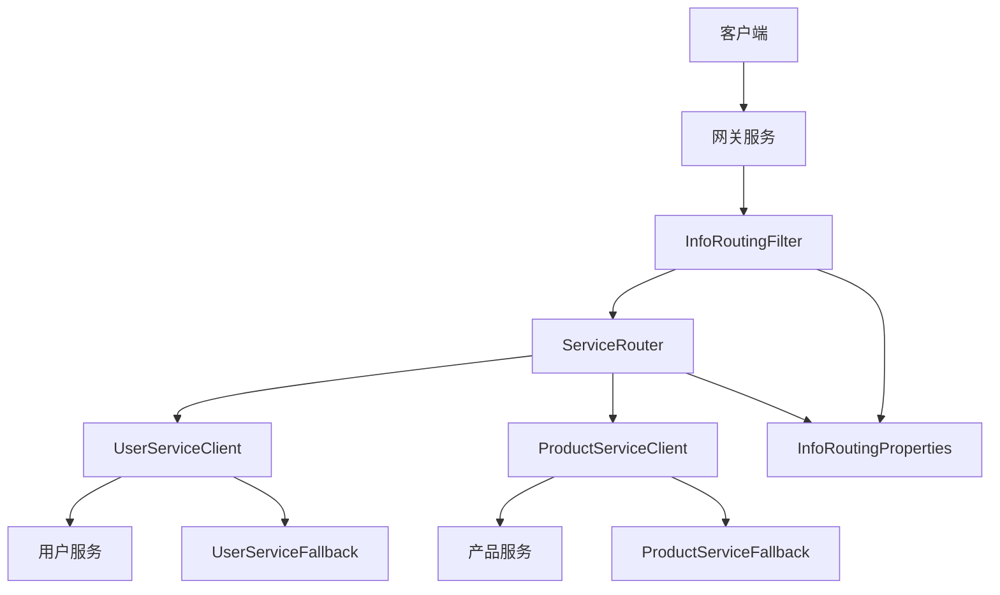
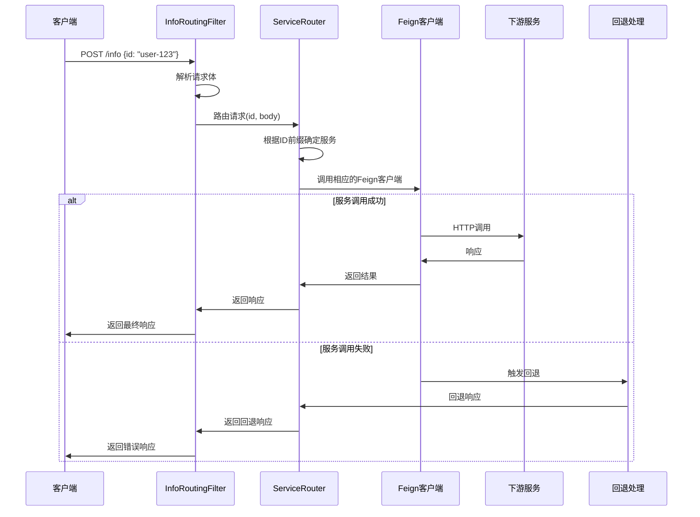

# 设计文档

## 概述

本设计将重构InfoRoutingFilter以使用Feign客户端进行服务通信，而不是依赖Spring Cloud Gateway的路由机制。当前实现存在架构不一致的问题：InfoRoutingFilter使用Gateway路由，而其他服务调用使用Feign客户端。此重构将统一服务调用模式，提供更好的错误处理、熔断和配置管理。

### 当前架构问题
- InfoRoutingFilter通过修改请求路径依赖Gateway路由
- Feign客户端存在但未被InfoRoutingFilter使用
- 服务URL在多个地方重复配置（InfoRoutingProperties、Feign注解、application.properties）
- 混合的服务调用模式导致维护困难

### 目标架构
- InfoRoutingFilter直接使用Feign客户端调用服务
- 统一的服务配置管理
- 一致的错误处理和熔断机制
- 支持服务发现和负载均衡

## 架构

### 高层架构图



### 组件交互流程



## 组件和接口

### 1. InfoRoutingFilter (重构)

**职责：**
- 拦截/info请求
- 解析请求体获取ID参数
- 委托给ServiceRouter进行实际的服务调用
- 处理响应和错误

**主要变更：**
- 移除路径修改逻辑
- 移除对Gateway路由的依赖
- 添加对ServiceRouter的依赖
- 简化为纯粹的请求拦截和委托

```java
public class InfoRoutingFilter implements WebFilter {
    private final ServiceRouter serviceRouter;
    private final ObjectMapper objectMapper;
    
    // 移除路径修改，直接调用ServiceRouter
    private Mono<Void> processInfoRequest(ServerWebExchange exchange, 
                                        InfoRequest infoRequest) {
        return serviceRouter.routeInfoRequest(infoRequest)
                .flatMap(response -> writeResponse(exchange, response))
                .onErrorResume(error -> handleError(exchange, error));
    }
}
```

### 2. ServiceRouter (新增)

**职责：**
- 根据ID前缀确定目标服务
- 管理Feign客户端的调用
- 统一错误处理和响应格式化
- 提供服务调用的抽象层

**接口设计：**
```java
@Component
public class ServiceRouter {
    private final UserInfoServiceClient userInfoServiceClient;
    private final ProductInfoServiceClient productInfoServiceClient;
    private final InfoRoutingProperties routingProperties;
    
    public Mono<ApiResponse> routeInfoRequest(InfoRequest request) {
        String targetService = routingProperties.determineTargetService(request.getId());
        
        return switch (targetService) {
            case "user-service" -> callUserInfoService(request);
            case "product-service" -> callProductInfoService(request);
            default -> Mono.error(new UnknownServiceException("未知的服务前缀"));
        };
    }
}
```

### 3. 专用的Info服务Feign客户端 (新增)

**UserInfoServiceClient：**
```java
@FeignClient(
    name = "user-service",
    url = "${gateway.info-routing.services.user-service.url}",
    fallback = UserInfoServiceFallback.class,
    configuration = FeignConfig.class
)
public interface UserInfoServiceClient {
    @PostMapping("/user/info")
    ApiResponse getUserInfo(@RequestBody InfoRequest request);
}
```

**ProductInfoServiceClient：**
```java
@FeignClient(
    name = "product-service", 
    url = "${gateway.info-routing.services.product-service.url}",
    fallback = ProductInfoServiceFallback.class,
    configuration = FeignConfig.class
)
public interface ProductInfoServiceClient {
    @PostMapping("/product/info")
    ApiResponse getProductInfo(@RequestBody InfoRequest request);
}
```

### 4. InfoRoutingProperties (保持简单)

**基本功能：**
- 保持现有的配置结构
- 只添加必要的Feign客户端URL配置

```java
@ConfigurationProperties(prefix = "gateway.info-routing")
public class InfoRoutingProperties {
    private boolean enabled = true;
    private Prefixes prefixes = new Prefixes();
    private Map<String, ServiceConfig> services = new HashMap<>();
    
    // 保持现有的简单结构
}
```

### 5. 回退处理 (增强)

**统一的回退响应格式：**
```java
@Component
public class UserInfoServiceFallback implements UserInfoServiceClient {
    @Override
    public ApiResponse getUserInfo(InfoRequest request) {
        return ApiResponse.error("用户信息服务暂时不可用", "SERVICE_UNAVAILABLE");
    }
}
```

## 数据模型

### InfoRequest (保持不变)
```java
public class InfoRequest {
    private String id;
    // 可能的扩展字段
    private Map<String, Object> additionalParams;
}
```

### ApiResponse (保持现有)
```java
public class ApiResponse {
    private String message;
    private String status;
    
    // 保持现有的简单结构
}
```

## 错误处理

### 简化的错误处理策略

1. **基本错误处理**
   - 使用Feign内置的回退机制
   - 保持现有的错误响应格式
   - 依赖Spring Boot的默认错误处理

2. **错误响应格式**
```json
{
  "message": "错误描述",
  "status": "ERROR_CODE"
}
```

## 测试策略

### 单元测试
1. **InfoRoutingFilter测试**
   - 请求解析测试
   - 错误处理测试
   - ServiceRouter集成测试

2. **ServiceRouter测试**
   - 路由逻辑测试
   - Feign客户端调用测试
   - 错误处理测试

3. **Feign客户端测试**
   - Mock服务响应测试
   - 回退机制测试
   - 错误解码测试

### 集成测试
1. **端到端测试**
   - 完整的/info请求流程测试
   - 多服务场景测试
   - 错误场景测试

2. **性能测试**
   - 并发请求处理测试
   - 响应时间测试
   - 资源使用测试

### 测试工具和框架
- JUnit 5用于单元测试
- Mockito用于Mock依赖
- WireMock用于Mock外部服务
- TestContainers用于集成测试
- Spring Boot Test用于应用上下文测试

## 配置管理

### 应用配置示例
```properties
# Info路由配置
gateway.info-routing.enabled=true
gateway.info-routing.use-service-discovery=false
gateway.info-routing.prefixes.user=user-
gateway.info-routing.prefixes.product=product-

# 服务配置
gateway.info-routing.services.user-service.url=http://localhost:8081
gateway.info-routing.services.user-service.enabled=true
gateway.info-routing.services.user-service.connect-timeout=5000
gateway.info-routing.services.user-service.read-timeout=10000

gateway.info-routing.services.product-service.url=http://localhost:8082
gateway.info-routing.services.product-service.enabled=true
gateway.info-routing.services.product-service.connect-timeout=5000
gateway.info-routing.services.product-service.read-timeout=10000

# Feign客户端配置
feign.client.config.default.connect-timeout=5000
feign.client.config.default.read-timeout=10000
feign.client.config.default.retry.max-attempts=3
```

### 服务发现配置（可选）
```properties
# 启用服务发现
gateway.info-routing.use-service-discovery=true
spring.cloud.discovery.enabled=true

# Consul配置示例
spring.cloud.consul.host=localhost
spring.cloud.consul.port=8500
spring.cloud.consul.discovery.service-name=gateway-service
```

## 配置管理

### 简化的应用配置
```properties
# Info路由配置（保持现有）
gateway.info-routing.enabled=true
gateway.info-routing.prefixes.user=user-
gateway.info-routing.prefixes.product=product-
gateway.info-routing.services.user-service.url=http://localhost:8081
gateway.info-routing.services.product-service.url=http://localhost:8082

# Feign客户端配置（使用现有）
feign.client.config.default.connect-timeout=5000
feign.client.config.default.read-timeout=10000
```

## 实施策略

### 简化的实施步骤
1. 创建专用的Info服务Feign客户端
2. 实现ServiceRouter组件
3. 重构InfoRoutingFilter使用ServiceRouter
4. 更新配置以支持新的Feign客户端
5. 运行现有测试确保功能正常