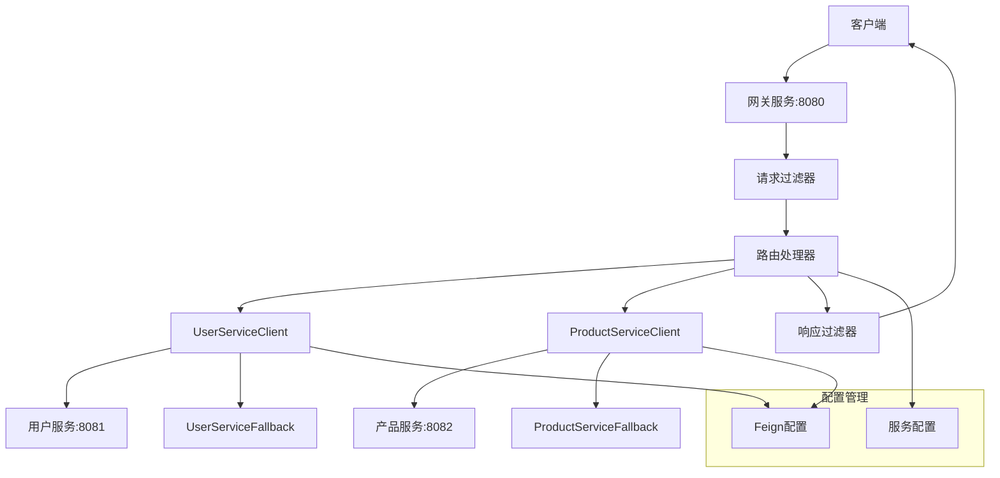
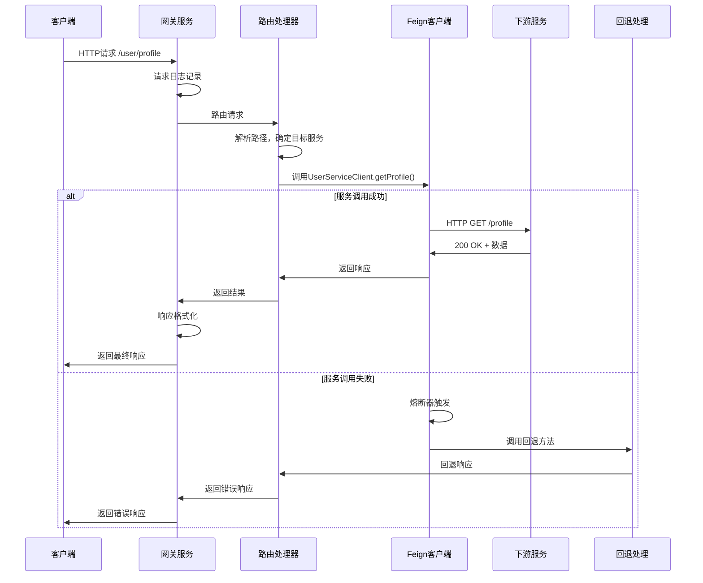

# 设计文档

## 概述

本设计将Spring Cloud Gateway中基于Resilience4j的熔断器功能完全替换为基于Feign客户端的服务调用模式。当前架构使用Spring Cloud Gateway的路由机制配合Resilience4j熔断器，这种方式在配置管理、错误处理和服务调用方面存在复杂性。通过引入Feign客户端作为主要的服务调用方式，我们可以获得更统一的架构、内置的负载均衡和熔断机制，同时简化整体配置。

### 当前架构问题
- Spring Cloud Gateway路由配置与Resilience4j熔断器配置分离，导致配置复杂
- 多层的错误处理机制（Gateway + Resilience4j + 自定义过滤器）
- 熔断器配置需要在多个地方维护（Java配置类 + YAML配置）
- 服务调用模式不统一（Gateway路由 vs 直接HTTP调用）

### 目标架构
- 使用Feign客户端作为唯一的服务调用方式
- 利用Feign内置的熔断器和重试机制
- 统一的配置管理和错误处理
- 保持现有的API接口不变，确保向后兼容

## 架构

### 高层架构图



### 组件交互流程



## 组件和接口

### 1. 路由处理器 (新增)

**职责：**
- 接收所有HTTP请求并根据路径前缀路由到相应的Feign客户端
- 处理路径转换（移除网关前缀）
- 统一的错误处理和响应格式化
- 替代Spring Cloud Gateway的路由功能

**接口设计：**
```java
@RestController
public class GatewayRouteHandler {
    
    private final UserServiceClient userServiceClient;
    private final ProductServiceClient productServiceClient;
    
    @RequestMapping("/user/**")
    public ResponseEntity<?> routeUserService(HttpServletRequest request, 
                                            HttpServletResponse response) {
        String targetPath = extractTargetPath(request.getRequestURI(), "/user");
        return delegateToUserService(targetPath, request);
    }
    
    @RequestMapping("/product/**")
    public ResponseEntity<?> routeProductService(HttpServletRequest request, 
                                               HttpServletResponse response) {
        String targetPath = extractTargetPath(request.getRequestURI(), "/product");
        return delegateToProductService(targetPath, request);
    }
}
```

### 2. Feign客户端接口 (重构)

**UserServiceClient：**
```java
@FeignClient(
    name = "user-service",
    url = "${gateway.services.user-service.url}",
    fallback = UserServiceFallback.class,
    configuration = FeignClientConfig.class
)
public interface UserServiceClient {
    
    @GetMapping("/{path}")
    ResponseEntity<Object> get(@PathVariable String path, 
                              @RequestParam Map<String, String> params);
    
    @PostMapping("/{path}")
    ResponseEntity<Object> post(@PathVariable String path, 
                               @RequestBody Object body,
                               @RequestParam Map<String, String> params);
    
    @PutMapping("/{path}")
    ResponseEntity<Object> put(@PathVariable String path, 
                              @RequestBody Object body,
                              @RequestParam Map<String, String> params);
    
    @DeleteMapping("/{path}")
    ResponseEntity<Object> delete(@PathVariable String path, 
                                 @RequestParam Map<String, String> params);
}
```

**ProductServiceClient：**
```java
@FeignClient(
    name = "product-service",
    url = "${gateway.services.product-service.url}",
    fallback = ProductServiceFallback.class,
    configuration = FeignClientConfig.class
)
public interface ProductServiceClient {
    
    @GetMapping("/{path}")
    ResponseEntity<Object> get(@PathVariable String path, 
                              @RequestParam Map<String, String> params);
    
    @PostMapping("/{path}")
    ResponseEntity<Object> post(@PathVariable String path, 
                               @RequestBody Object body,
                               @RequestParam Map<String, String> params);
    
    @PutMapping("/{path}")
    ResponseEntity<Object> put(@PathVariable String path, 
                              @RequestBody Object body,
                              @RequestParam Map<String, String> params);
    
    @DeleteMapping("/{path}")
    ResponseEntity<Object> delete(@PathVariable String path, 
                                 @RequestParam Map<String, String> params);
}
```

### 3. Feign配置 (新增)

**FeignClientConfig：**
```java
@Configuration
public class FeignClientConfig {
    
    @Bean
    public RequestInterceptor requestInterceptor() {
        return requestTemplate -> {
            // 添加通用请求头
            requestTemplate.header("X-Gateway-Request", "true");
            requestTemplate.header("X-Request-ID", UUID.randomUUID().toString());
        };
    }
    
    @Bean
    public ErrorDecoder errorDecoder() {
        return new GatewayErrorDecoder();
    }
    
    @Bean
    public Retryer retryer() {
        return new Retryer.Default(100, 1000, 3);
    }
}
```

### 4. 回退处理 (重构)

**UserServiceFallback：**
```java
@Component
public class UserServiceFallback implements UserServiceClient {
    
    private static final Logger logger = LoggerFactory.getLogger(UserServiceFallback.class);
    
    @Override
    public ResponseEntity<Object> get(String path, Map<String, String> params) {
        logger.warn("User service fallback triggered for GET {}", path);
        return createFallbackResponse("用户服务暂时不可用");
    }
    
    @Override
    public ResponseEntity<Object> post(String path, Object body, Map<String, String> params) {
        logger.warn("User service fallback triggered for POST {}", path);
        return createFallbackResponse("用户服务暂时不可用");
    }
    
    private ResponseEntity<Object> createFallbackResponse(String message) {
        ApiResponse<Object> response = new ApiResponse<>();
        response.setSuccess(false);
        response.setMessage(message);
        response.setData(null);
        return ResponseEntity.status(HttpStatus.SERVICE_UNAVAILABLE).body(response);
    }
}
```

### 5. 错误处理 (新增)

**GatewayErrorDecoder：**
```java
public class GatewayErrorDecoder implements ErrorDecoder {
    
    private final ErrorDecoder defaultErrorDecoder = new Default();
    
    @Override
    public Exception decode(String methodKey, Response response) {
        switch (response.status()) {
            case 400:
            case 401:
            case 403:
            case 404:
                // 客户端错误，透传原始响应
                return new FeignClientException(response.status(), response.reason(), response);
            case 500:
            case 502:
            case 503:
            case 504:
                // 服务器错误，触发熔断器
                return new FeignServerException(response.status(), response.reason());
            default:
                return defaultErrorDecoder.decode(methodKey, response);
        }
    }
}
```

### 6. 配置属性 (简化)

**GatewayServiceProperties：**
```java
@ConfigurationProperties(prefix = "gateway")
@Component
public class GatewayServiceProperties {
    
    private Map<String, ServiceConfig> services = new HashMap<>();
    
    public static class ServiceConfig {
        private String url;
        private int connectTimeout = 5000;
        private int readTimeout = 10000;
        private boolean enabled = true;
        
        // getters and setters
    }
    
    // getters and setters
}
```

## 数据模型

### 请求/响应模型 (保持现有)

**ApiResponse：**
```java
public class ApiResponse<T> {
    private boolean success;
    private String message;
    private T data;
    
    // 保持现有实现
}
```

### 异常模型 (新增)

**FeignClientException：**
```java
public class FeignClientException extends RuntimeException {
    private final int status;
    private final String reason;
    private final Response response;
    
    // 用于4xx错误，不触发熔断器
}
```

**FeignServerException：**
```java
public class FeignServerException extends RuntimeException {
    private final int status;
    private final String reason;
    
    // 用于5xx错误，触发熔断器
}
```

## 错误处理

### 错误处理策略

1. **客户端错误 (4xx)**
   - 透传原始错误响应
   - 不触发熔断器
   - 记录警告日志

2. **服务器错误 (5xx)**
   - 触发熔断器
   - 返回统一的错误格式
   - 记录错误日志

3. **超时错误**
   - 触发熔断器
   - 返回408状态码
   - 记录超时日志

4. **熔断器开启**
   - 直接调用回退方法
   - 返回503状态码
   - 记录熔断器状态

### 错误响应格式

```json
{
  "success": false,
  "message": "错误描述",
  "data": null,
  "errorCode": "ERROR_CODE",
  "timestamp": "2024-01-01T12:00:00Z"
}
```

## 测试策略

### 单元测试

1. **路由处理器测试**
   - 路径解析和转换测试
   - 请求参数转发测试
   - 错误处理测试

2. **Feign客户端测试**
   - Mock服务响应测试
   - 回退机制测试
   - 错误解码测试

3. **配置测试**
   - 配置属性加载测试
   - Feign客户端配置测试
   - 服务发现配置测试

### 集成测试

1. **端到端测试**
   - 完整的请求流程测试
   - 多服务场景测试
   - 错误场景测试

2. **性能测试**
   - 并发请求处理测试
   - 响应时间测试
   - 熔断器性能测试

3. **容错测试**
   - 服务不可用场景测试
   - 网络超时场景测试
   - 熔断器恢复测试

## 配置管理

### 应用配置

```properties
# 服务器配置
server.port=8080
spring.application.name=gateway-service

# 服务配置
gateway.services.user-service.url=http://localhost:8081
gateway.services.user-service.enabled=true
gateway.services.user-service.connect-timeout=5000
gateway.services.user-service.read-timeout=10000

gateway.services.product-service.url=http://localhost:8082
gateway.services.product-service.enabled=true
gateway.services.product-service.connect-timeout=5000
gateway.services.product-service.read-timeout=10000

# Feign配置
feign.client.config.default.connect-timeout=5000
feign.client.config.default.read-timeout=10000
feign.client.config.default.logger-level=basic

# Feign熔断器配置
feign.circuitbreaker.enabled=true
feign.client.config.default.retry.max-attempts=3
feign.client.config.default.retry.backoff.multiplier=1.5

# 日志配置
logging.level.com.example.gateway=DEBUG
logging.level.feign=DEBUG
```

### 服务发现配置 (可选)

```properties
# 启用服务发现
spring.cloud.discovery.enabled=true
spring.cloud.consul.host=localhost
spring.cloud.consul.port=8500

# 使用服务发现的服务配置
gateway.services.user-service.service-name=user-service
gateway.services.product-service.service-name=product-service
```

## 迁移策略

### 迁移步骤

1. **阶段1：准备工作**
   - 添加Feign依赖
   - 创建Feign客户端接口
   - 实现回退处理类

2. **阶段2：核心实现**
   - 实现路由处理器
   - 配置Feign客户端
   - 实现错误处理

3. **阶段3：配置迁移**
   - 更新配置文件
   - 移除Resilience4j配置
   - 更新依赖项

4. **阶段4：测试和验证**
   - 运行所有测试
   - 验证功能一致性
   - 性能测试

5. **阶段5：清理**
   - 移除旧的Gateway路由配置
   - 删除Resilience4j相关代码
   - 更新文档

### 风险控制

1. **功能验证**
   - 保持现有API接口不变
   - 确保响应格式一致
   - 验证错误处理行为

2. **性能监控**
   - 监控响应时间变化
   - 检查内存使用情况
   - 验证并发处理能力

3. **回滚计划**
   - 保留原有配置作为备份
   - 准备快速回滚方案
   - 监控关键指标

## 依赖变更

### 新增依赖

```xml
<dependency>
    <groupId>org.springframework.cloud</groupId>
    <artifactId>spring-cloud-starter-openfeign</artifactId>
</dependency>
<dependency>
    <groupId>org.springframework.boot</groupId>
    <artifactId>spring-boot-starter-web</artifactId>
</dependency>
```

### 移除依赖

```xml
<!-- 移除这些依赖 -->
<dependency>
    <groupId>org.springframework.cloud</groupId>
    <artifactId>spring-cloud-starter-gateway</artifactId>
</dependency>
<dependency>
    <groupId>org.springframework.cloud</groupId>
    <artifactId>spring-cloud-starter-circuitbreaker-reactor-resilience4j</artifactId>
</dependency>
<dependency>
    <groupId>org.springframework.boot</groupId>
    <artifactId>spring-boot-starter-webflux</artifactId>
</dependency>
```

### 架构变更影响

1. **从WebFlux到WebMVC**
   - 所有响应式编程模式需要改为同步模式
   - Mono/Flux类型需要替换为标准Java类型
   - 过滤器需要从WebFilter改为Servlet Filter

2. **从Gateway到RestController**
   - 路由配置改为Controller映射
   - 路径匹配改为RequestMapping
   - 过滤器链改为拦截器链