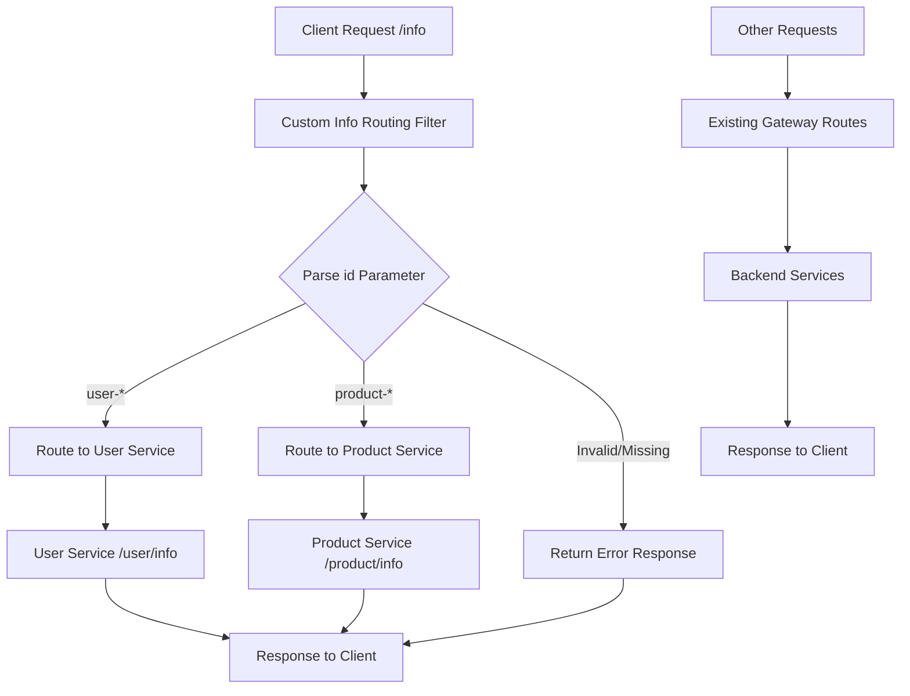

# 设计文档

## 概述

本设计在Spring Cloud Gateway中实现了一个自定义WebFilter，基于请求参数分析为`/info`端点提供智能路由。该解决方案采用响应式方法，与现有网关配置无缝集成，同时添加基于参数的路由逻辑。

## 架构

该解决方案遵循Spring Cloud Gateway的响应式架构模式：



## 组件和接口

### 1. InfoRoutingFilter (WebFilter实现)

**目的：** 自定义过滤器，拦截`/info`请求并基于id参数前缀进行路由。

**主要职责：**
- 拦截对`/info`端点的请求
- 从请求体中解析和验证`id`参数
- 基于id前缀确定目标服务
- 修改请求路径并转发到适当的服务
- 优雅地处理错误并返回适当的HTTP状态码

**Interface:**
```java
public class InfoRoutingFilter implements WebFilter {
    @Override
    public Mono<Void> filter(ServerWebExchange exchange, WebFilterChain chain);
}
```

### 2. RoutingConfiguration

**目的：** 配置类，用于管理路由规则和服务映射。

**主要职责：**
- 定义前缀到服务的映射
- 提供可配置的路由规则
- 支持运行时配置更新

### 3. InfoRoutingProperties

**目的：** 路由行为的配置属性。

**属性：**
- `gateway.info-routing.enabled`: 启用/禁用自定义路由
- `gateway.info-routing.prefixes.user`: 用户服务前缀 (默认: "user-")
- `gateway.info-routing.prefixes.product`: 产品服务前缀 (默认: "product-")
- `gateway.info-routing.services.user-service.url`: 用户服务URL
- `gateway.info-routing.services.product-service.url`: 产品服务URL

## 数据模型

### 请求/响应模型

**InfoRequest:**
```java
public class InfoRequest {
    private String id;
    // getters and setters
}
```

**ErrorResponse:**
```java
public class ErrorResponse {
    private String message;
    private String code;
    private long timestamp;
    // constructors, getters and setters
}
```

## 错误处理

### 简化的错误场景

1. **缺少或无效ID参数**
   - HTTP状态: 400 Bad Request
   - 响应: 简单的错误消息

2. **服务不可用**
   - 使用现有的网关错误处理机制

## 实现细节

### 过滤器处理流程

1. **请求拦截：**
   - 检查请求路径是否匹配`/info`
   - 如果不匹配，传递给链中的下一个过滤器
   - 如果匹配，继续执行自定义路由逻辑

2. **参数提取：**
   - 读取请求体以提取JSON负载
   - 从JSON中解析`id`参数
   - 验证参数的存在性和格式

3. **服务解析：**
   - 将id前缀与配置的映射进行匹配
   - 确定目标服务URL
   - 验证服务可用性

4. **请求转换：**
   - 修改请求路径到目标服务端点
   - 如有必要，更新请求头
   - 将请求转发到确定的服务

5. **响应处理：**
   - 将服务响应返回给客户端
   - 处理处理过程中的任何错误
   - 确保适当的HTTP状态码

### 与现有路由的集成

自定义过滤器以比现有路由谓词更高的优先级运行：

- **过滤器顺序：** 设置为高优先级（例如，-100）以在标准路由之前执行
- **条件处理：** 仅处理`/info`请求，允许其他请求使用现有配置
- **回退行为：** 如果自定义路由失败，请求可以回退到标准路由规则

### 配置集成

该解决方案与现有的Spring Cloud Gateway配置集成：

```properties
# 现有路由保持不变
spring.cloud.gateway.routes[0].id=user-service
spring.cloud.gateway.routes[0].uri=http://localhost:8081
spring.cloud.gateway.routes[0].predicates[0]=Path=/user/**

# 新的自定义路由配置
gateway.info-routing.enabled=true
gateway.info-routing.prefixes.user=user-
gateway.info-routing.prefixes.product=product-
gateway.info-routing.services.user-service.url=http://localhost:8081
gateway.info-routing.services.product-service.url=http://localhost:8082
```

## 测试策略

### 单元测试

1. **InfoRoutingFilterTest:**
   - 测试参数提取和验证
   - 测试服务解析逻辑
   - 测试错误处理场景
   - 测试请求转换

2. **RoutingConfigurationTest:**
   - 测试配置加载
   - 测试前缀匹配逻辑
   - 测试服务URL解析

### 集成测试

1. **InfoRoutingIntegrationTest:**
   - 测试用户前缀id的端到端路由
   - 测试产品前缀id的端到端路由
   - 测试无效请求的错误响应
   - 测试非info端点回退到现有路由

2. **GatewayFilterChainTest:**
   - 测试过滤器与现有网关过滤器的集成
   - 测试过滤器排序和优先级
   - 测试对现有路由的性能影响

### 性能考虑

- **响应式处理：** 使用非阻塞响应式流进行请求处理
- **内存效率：** 在请求处理过程中最小化对象创建
- **缓存：** 缓存服务URL解析以减少查找开销
- **错误处理：** 对无效请求快速失败以最小化资源使用

## 简化实现

由于这是本地demo项目，我们将专注于核心功能：
- 基本的参数验证
- 简单的路由逻辑
- 最小化的错误处理
- 与现有配置的兼容性